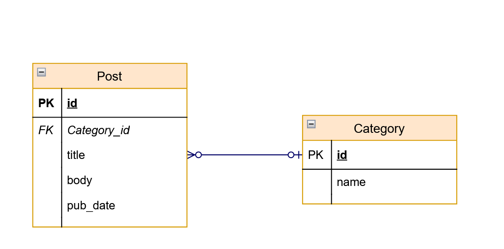

# SQLAlchemy quickstart

This is a repo where I learn flask-sqlalchemy from the [official docs](https://flask-sqlalchemy.palletsprojects.com/en/2.x/)

## Setup

Here I'm setting up a virtual env to install flask-sqlalchemy module

Terminal - **bash** (commands differ for cmd)

1. Set up virtualenv
    ```bash
    $ virtualenv venv
    ```
2. Activate venv
    ```bash
    $ source venv/scripts/activate
    ```
3. Install required modules
    ```bash
    pip install flask flask-sqlalchemy
    ```
    verisons I'm using:
    - Python 3.9.6
    - flask-2.0.2
    - flask-sqlalchemy-2.5.1

## Quick start

### Initializing a database

To create the initial database, just import the db object from an interactive Python shell and run the SQLAlchemy.create_all() method to create the tables and database:

```py
>>> from app import db
>>> db.create_all()
```

### Creating users, inserting and querying

The table defined in app.py is:

```py
class User(db.Model):
    id = db.Column(db.Integer, primary_key=True)
    username = db.Column(db.String(80), unique=True, nullable=False)
    email = db.Column(db.String(120), unique=True, nullable=False)
```

#### create

```py
>>> from yourapplication import User
>>> admin = User(username='admin', email='admin@example.com')
>>> guest = User(username='guest', email='guest@example.com')
```

#### Insert

```py
>>> db.session.add(admin)
>>> db.session.add(guest)
>>> db.session.commit()
```

#### Query

```py
>>> User.query.all()
[<User u'admin'>, <User u'guest'>]
>>> User.query.filter_by(username='admin').first()
<User u'admin'>
```

## Simple Relationships



```py
class Post(db.Model):
    id = db.Column(db.Integer, primary_key=True)
    title = db.Column(db.String(80), nullable=False)
    body = db.Column(db.Text, nullable=False)
    pub_date = db.Column(db.DateTime, nullable=False,
                         default=datetime.utcnow)

    category_id = db.Column(db.Integer, db.ForeignKey('category.id'),
                            nullable=False)
    category = db.relationship('Category',
                               backref=db.backref('posts', lazy=True))


class Category(db.Model):
    id = db.Column(db.Integer, primary_key=True)
    name = db.Column(db.String(50), nullable=False)
```
#### Adding records

```py
>>> py = Category(name='Python')
# method 1
>>> Post(title='Hello Python!', body='Python is pretty cool', category=py)
# method 2
>>> p = Post(title='Snakes', body='Ssssssss')
>>> py.posts.append(p)
>>> db.session.add(py)
```

#### About Backref

Here backref adds a property posts in Category object. The `posts` object in the following snippet is a *list* of `Post` table objects of the category "Python". 
```py
py_category = Category.query.filter_by(name='Python').first()
posts = py_category.posts
```

Accessing `posts` will load them from the database since the relationship is lazy-loaded, but you will probably not notice the difference - loading a list is quite fast.

##### override the loading strategy

However, it can easily become a major bottleneck when you end up triggering extra queries in a loop for more than a few objects. For this case, SQLAlchemy lets you override the loading strategy on the query level. If you wanted a single query to load all categories and their posts, you could do it like this:

```py
>>> from sqlalchemy.orm import joinedload
>>> query = Category.query.options(joinedload('posts'))
>>> for category in query:
...     print category, category.posts
<Category u'Python'> [<Post u'Hello Python!'>, <Post u'Snakes'>]
```

#### Quering with the relationship

If you want to get a query object for that relationship, you can do so using with_parent().

```py
>>> py = Category.query.filter_by(name='Python').first()
>>> Post.query.with_parent(py).filter(Post.title != 'Snakes').all()
[<Post 'Hello Python!'>]
```

This searches all the post with category "Python" AND title not 'Snakes'
